<picture>
  <source media="(prefers-color-scheme: dark)" srcset="./dark.svg">
  <source media="(prefers-color-scheme: light)" srcset="./light.svg">
  
</picture>

<h1 data-importer="text" align="center">Salamalekom</h1>

###

  
  
  
  
  
  
  
  
  
  
  
  
  
  
  
  
  

###

  
  
  

###

  
  

###

<picture data-importer="pacman">
  <source media="(prefers-color-scheme: dark)" srcset="https://raw.githubusercontent.com/APIEP-EXE/APIEP-EXE/pacman-output/pacman-contribution-graph-dark.svg?game=pacman">
  <source media="(prefers-color-scheme: light)" srcset="https://raw.githubusercontent.com/APIEP-EXE/APIEP-EXE/pacman-output/pacman-contribution-graph.svg?game=pacman">
  
</picture>

###

  

